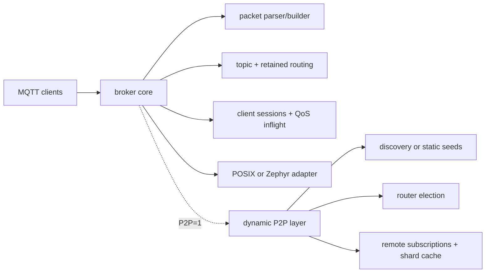
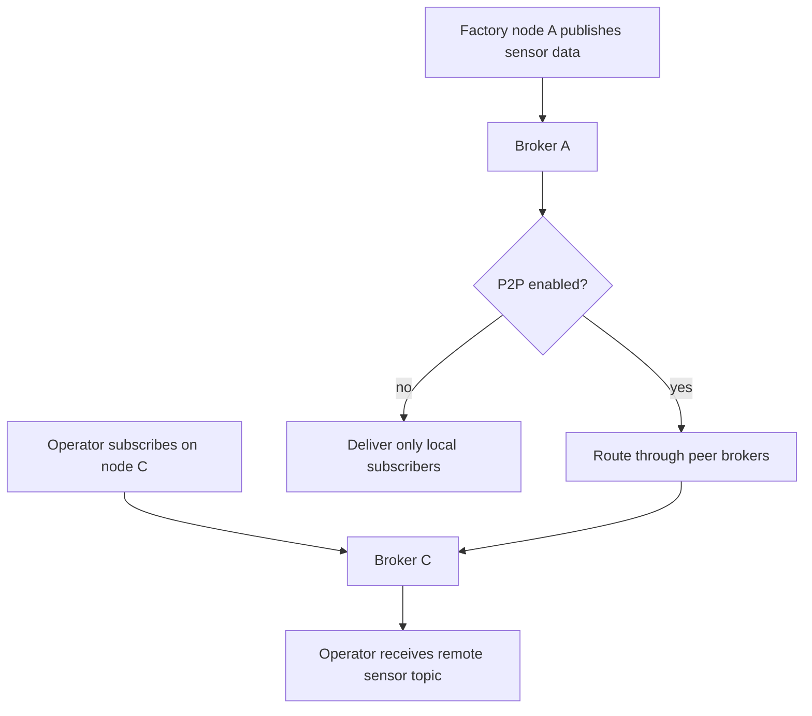

# mqtt_min_broker

Reusable MQTT v3.1.1 broker for Linux development and Zephyr/ESP32 embedding.

## Overview

`mqtt_min_broker` is the broker engine used by Dephy products. It supports the
normal single-broker MQTT path and an optional dynamic P2P broker layer for
field nodes that need to route messages across multiple brokers.

## Key Value

- MQTT v3.1.1 core: QoS 0/1/2, retained messages, sessions, keepalive, LWT,
  auth tests, malformed-packet coverage, and bounded packet buffers.
- Optional Linux HTTP dashboard for status and publish testing.
- Optional `CONFIG_MQTT_P2P_DYNAMIC` / `P2P=1` mode with discovery, router
  election, peer links, remote subscription routing, and shard-owner caching.
- Optional `CONFIG_MQTT_P2P_STATIC_SEEDS_ONLY` mode for deterministic embedded
  or same-host tests without UDP discovery.
- POSIX and Zephyr adapters around the same portable C broker core.

## How To Use

```sh
make -f Makefile.linux
make -f Makefile.linux test
make -f Makefile.linux test-all
make -f Makefile.linux DASHBOARD=1
make -f Makefile.linux P2P=1 test-all
make -f Makefile.linux P2P=1 STATIC_SEEDS_ONLY=1
```

Dynamic P2P smoke tests:

```sh
./scripts/test_p2p_dynamic.sh
./scripts/test_p2p_static_seeds_only.sh
```

Products should pin this module in `deps.json`, sync it into `deps/`, include
the public headers, and start the broker from product-owned runtime code.

## Architecture Flow



## Example User Scenario



## Simple Principle

The broker core owns MQTT behavior. Platform adapters provide OS integration.
The optional dynamic P2P layer observes local publish/subscribe activity and
routes matching traffic between brokers.

## Performance

Latest recorded P2P scale result in `docs/readme_legacy.md`:

| Brokers | Throughput | p95 latency | Result |
| --- | ---: | ---: | --- |
| 1 | 70,550.14 msg/s | 2.794 ms | pass |
| 5 | 62,341.01 msg/s | 0.421 ms | pass |

Run fresh benchmarks with:

```sh
scripts/bench_p2p_scale.sh
scripts/bench_p2p_docker_scale.sh
```

## Docs

- `docs/readme_legacy.md`: detailed feature, API, benchmark, and historical
  release notes.
- `docs/p2p_shard_model.md`: P2P sharding and routing model.
- `docs/mesh_test_matrix.md`: mesh validation matrix.
- `docs/module_structure.md`: module layout and public contract.
- `docs/todo.md`: current TODO summary.

## License

MIT. See `LICENSE` and `NOTICE.md`. Reuse and references are allowed, but the
copyright notice and attribution to Judd (judadao) must be preserved.
