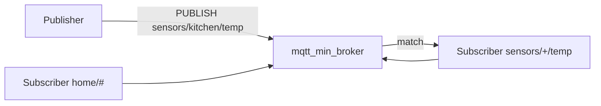
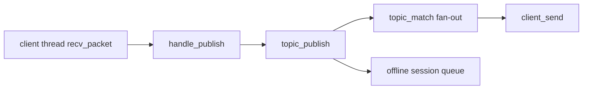
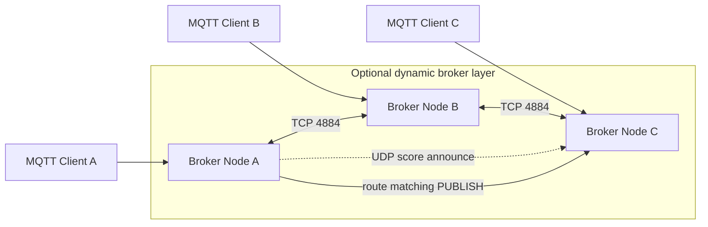
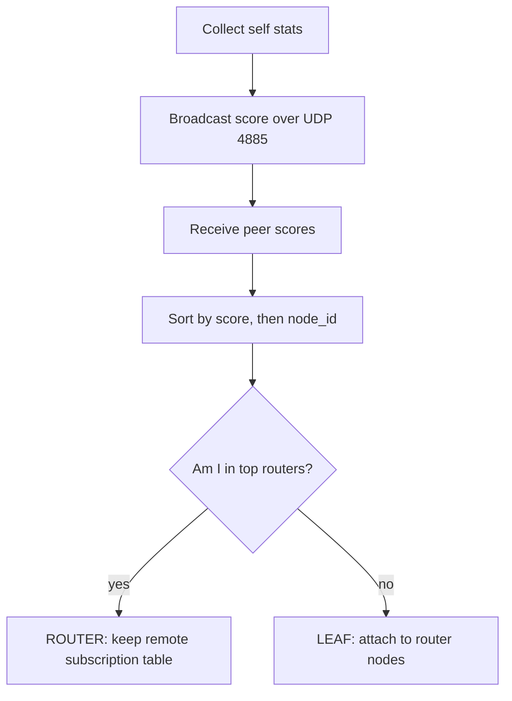
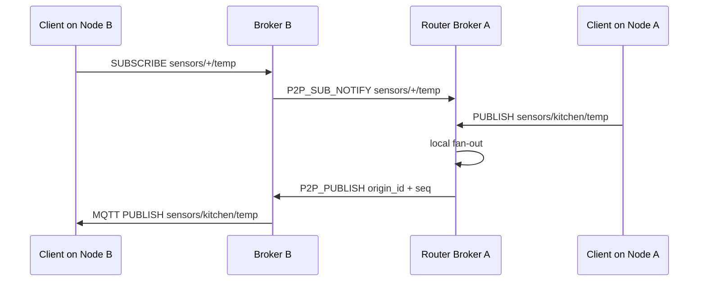
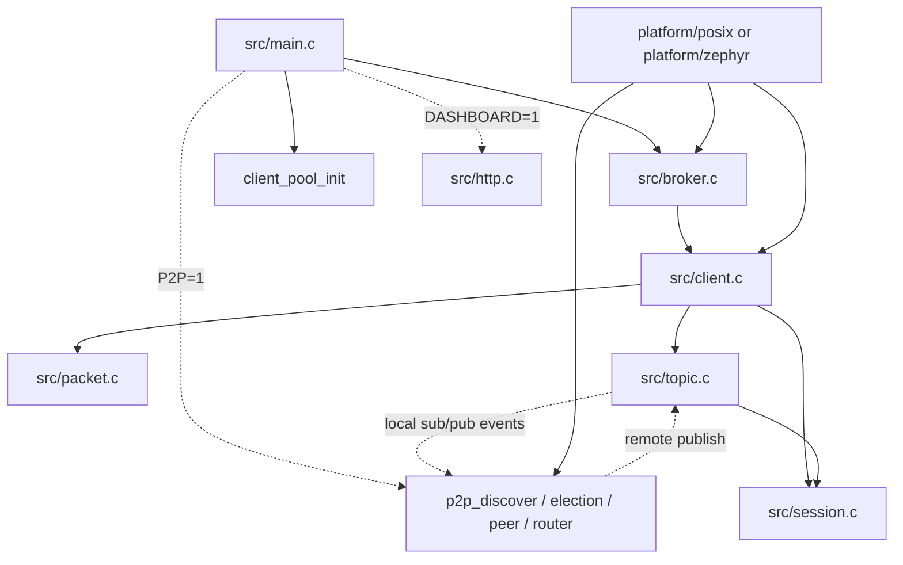

# mqtt_min_broker

A minimal MQTT v3.1.1 broker written in C. Runs on both **Linux** (for development/testing) and **Zephyr RTOS / ESP32** (production). No external dependencies beyond libc.

## Features

- MQTT v3.1.1: QoS 0, QoS 1, QoS 2
- Topic wildcard matching (`+` single-level, `#` multi-level); `$`-prefixed topics immune to `#` per §4.7.2
- Retained message store
- Persistent sessions (`clean_session = 0`) with offline message queuing; QoS-1 inflight saved to session on TCP disconnect
- Keepalive timeout enforcement; QoS-1/2 inflight retry with DUP flag
- Protocol compliance hardening: fixed-header reserved bits (§2.2.2), protocol name/version (§3.1.2.1), CONNACK 0x01 for unsupported version (§3.2.2.3), remaining-length enforcement, malformed-packet close
- Optional username/password auth (compile-time)
- Optional HTTP status dashboard + REST API (Linux, port 8080)
- Optional dynamic broker P2P mode with router election and inter-node routing
- Up to 8 concurrent clients; zero heap allocation

Not implemented: TLS, WebSocket.

---

## How It Works

In normal mode this is a single MQTT broker. Clients connect to port `1883`, subscribe to topic filters, and receive matching publishes locally.



The local publish path is small and static:



### Optional Dynamic Broker Mode

Dynamic broker mode is optional and disabled by default. In normal mode, every MQTT client connects to one standalone broker. In dynamic mode, clients can still connect to any broker, but the brokers form a small P2P network behind the scenes and route matching publishes to the node that owns the subscriber.



Enable it with `P2P=1` on Linux or `CONFIG_MQTT_P2P_DYNAMIC=y` on Zephyr.

#### Role election

Every node calculates a resource score and announces it. Each node independently sorts the same score table; the top nodes become routers.



Score is intentionally simple and deterministic:

```text
score = free_client_slots * 10
      + uptime_bonus
      - active_peer_count * 5
```

On Zephyr, `P2P_PEER_MAX` defaults lower than Linux to fit ESP32 RAM.

#### Subscription and publish routing

Subscribers remain normal MQTT clients. The P2P layer only mirrors subscription intent between brokers.



Loop prevention uses `(origin_id, seq)` in each P2P publish. Nodes keep a small seen-message ring buffer and drop duplicates.

## Quick Start — Linux

Build and test locally with no Zephyr toolchain required.

```bash
# build broker + CLI tool  ->  build_out/mqtt_broker, build_out/mqtt_cli
make -f Makefile.linux

# start broker (listens on :1883)
./build_out/mqtt_broker

# subscribe (another terminal; Ctrl-C to stop)
./build_out/mqtt_cli sub -t "test/#"

# publish
./build_out/mqtt_cli pub -t test/hello -m "world"
./build_out/mqtt_cli pub -t test/temp  -m "23.5" -q 1
./build_out/mqtt_cli pub -t test/keep  -m "hi"   -r

# run automated test suite
./scripts/test_broker.sh
```

### Build variants

```bash
# HTTP dashboard on :8080
make -f Makefile.linux DASHBOARD=1

# username/password auth
make -f Makefile.linux AUTH_USER=admin AUTH_PASS=secret

# dynamic broker P2P mode
make -f Makefile.linux P2P=1
```

### Dynamic broker local test

Linux local multi-node tests seed peers explicitly because same-host UDP broadcast is not always reliable:

```bash
MQTT_P2P_PEERS=127.0.0.1:48842 ./build_out/mqtt_broker
./scripts/test_p2p_dynamic.sh
```

Compile-time overrides are available for local tests:

```bash
make -f Makefile.linux P2P=1 MQTT_PORT=1884 P2P_PORT=4894 P2P_DISCOVERY_PORT=4895
```

---

## mqtt_cli Reference

```
mqtt_cli pub  [-h HOST] [-p PORT] [-i ID] [-u USER] [-P PASS]
              -t TOPIC -m MSG [-q 0|1] [-r]

mqtt_cli sub  [-h HOST] [-p PORT] [-i ID] [-u USER] [-P PASS]
              -t TOPIC [-q 0|1]

mqtt_cli status [-h HOST] [-p PORT]
```

| Option | Default | Description |
|--------|---------|-------------|
| `-h HOST` | `127.0.0.1` | Broker host |
| `-p PORT` | `1883` (MQTT) / `8080` (status) | Port |
| `-i ID` | `mqtt_cli_<pid>` | Client ID |
| `-u USER` | — | Username |
| `-P PASS` | — | Password |
| `-t TOPIC` | — | Topic |
| `-m MSG` | — | Message payload |
| `-q 0\|1` | `0` | QoS level |
| `-r` | off | Set retained flag |

`sub` prints one line per received message: `topic payload`. `status` hits the HTTP dashboard's `/api/status` endpoint and prints the JSON response.

---

## HTTP Dashboard

Enable with `DASHBOARD=1` at build time. Serves on port 8080:

| Endpoint | Description |
|----------|-------------|
| `GET /` | HTML page — connected clients, subscriptions, retained messages, publish form |
| `GET /api/status` | JSON snapshot of all broker state |
| `POST /api/publish` | Publish a message: `{"topic":"…","payload":"…","qos":0}` |

---

## Zephyr / ESP32 Build (Docker)

No Zephyr toolchain or SDK needed on the host.

```bash
# first run builds the Docker image (~15 min, only once)
./docker-build.sh

# subsequent runs (source is mounted, image is reused)
./docker-build.sh

# target a different board
BOARD=esp32s3 ./docker-build.sh

# force image rebuild (e.g. after Dockerfile change)
REBUILD_ENV=1 ./docker-build.sh
```

Firmware lands in `./build_out/` (`zephyr.bin`, `zephyr.elf`).

Flash from host after build:

```bash
west flash
west espressif monitor   # serial console
```

---

## Zephyr Module Usage

Embed this repo as a module in any Zephyr project.

**`west.yml`:**

```yaml
manifest:
  projects:
    - name: mqtt_min_broker
      url: https://github.com/judadao/zephy_min_mqtt_broker
      revision: main
      path: modules/mqtt_min_broker
```

Run `west update` once.

**`prj.conf`** (minimum):

```
CONFIG_MQTT_MIN_BROKER=y
CONFIG_NETWORKING=y
CONFIG_NET_TCP=y
CONFIG_NET_SOCKETS=y
CONFIG_NET_IPV4=y
```

**`main.c`:**

```c
#include "broker.h"

int main(void)
{
    /* bring up WiFi / network first */
    broker_init();
    broker_run(); /* does not return */
    return 0;
}
```

No changes to `CMakeLists.txt` needed.

---

## Configuration

### Kconfig options

| Option | Default | Description |
|--------|---------|-------------|
| `CONFIG_MQTT_AUTH_ENABLED` | n | Require username + password on CONNECT |
| `CONFIG_MQTT_AUTH_USERNAME` | `"admin"` | Required username |
| `CONFIG_MQTT_AUTH_PASSWORD` | `""` | Required password |
| `CONFIG_MQTT_WIFI_SSID` | `""` | WiFi SSID (standalone mode) |
| `CONFIG_MQTT_WIFI_PASSWORD` | `""` | WiFi password (standalone mode) |
| `CONFIG_MQTT_WIFI_DHCP` | y | Use DHCP (or STATIC) |
| `CONFIG_MQTT_HTTP_DASHBOARD` | n | HTTP dashboard (Linux only) |
| `CONFIG_MQTT_P2P_DYNAMIC` | n | Dynamic router election and inter-node routing |

Copy `prj.conf.template` → `prj.conf` and fill in credentials. `prj.conf` is gitignored.

### Code-level constants (`include/broker.h`, `include/client.h`, `include/packet.h`)

| Constant | Default | Description |
|----------|---------|-------------|
| `MQTT_BROKER_PORT` | `1883` | TCP listen port |
| `MQTT_MAX_CLIENTS` | `8` | Max concurrent connections |
| `CLIENT_STACK_SIZE` | `2048` | Per-client thread stack (bytes, Zephyr) |
| `CLIENT_INFLIGHT_MAX` | `4` | QoS-1 inflight slots per client |
| `MQTT_TOPIC_MAX` | `128` | Max topic length |
| `MQTT_PAYLOAD_MAX` | `512` | Max publish payload |

---

## Build Output

All build artifacts land in `build_out/` regardless of platform. Each file is stamped with version + date; a `latest` symlink without the stamp is also created.

| Symlink (always latest) | Stamped file | Platform |
|------------------------|--------------|----------|
| `build_out/mqtt_broker` | `build_out/mqtt_broker_v0.1.0_20260615` | Linux |
| `build_out/mqtt_cli` | `build_out/mqtt_cli_v0.1.0_20260615` | Linux |
| `build_out/zephyr.bin` | `build_out/zephyr_v0.1.0_20260615.bin` | Zephyr/ESP32 |
| `build_out/zephyr.elf` | `build_out/zephyr_v0.1.0_20260615.elf` | Zephyr/ESP32 |
| `build_out/zephyr.map` | `build_out/zephyr_v0.1.0_20260615.map` | Zephyr/ESP32 |

Version is read from the Zephyr-format `VERSION` file (currently `0.1.0`). Override at build time:

```bash
make -f Makefile.linux VERSION=1.2.3
VERSION=1.2.3 ./docker-build.sh
```

`build_out/` is gitignored.

---

## Architecture



| Area | Files | Purpose |
|------|-------|---------|
| MQTT protocol | `src/client.c`, `src/packet.c` | CONNECT/PUBLISH/SUBSCRIBE handling and packet encode/decode |
| Local routing | `src/topic.c`, `src/session.c` | Local subscriptions, retained messages, persistent sessions |
| Optional P2P | `src/p2p_*.c`, `include/p2p.h` | Discovery, election, peer links, remote subscription routing |
| Platform layer | `platform/posix/`, `platform/zephyr/` | Socket, mutex, thread, time, and logging abstraction |

Concurrency: one thread per MQTT client. P2P mode adds discovery, connect/accept, and peer threads. Shared state is guarded by per-module mutexes (`pool_lock`, `topic_lock`, `session_lock`, P2P locks).

---

## Test Suite

```bash
# stop mosquitto if running on :1883
sudo systemctl stop mosquitto

./scripts/test_broker.sh        # QoS 0/1, wildcard +/#, retained, fan-out, $SYS
./scripts/test_session.sh       # persistent sessions, offline queuing, inflight retransmit
./scripts/test_malformed.sh     # malformed packet rejection and connection close
./scripts/test_connect_edge.sh  # CONNECT edge cases, protocol name/version
./scripts/test_p2p_dynamic.sh   # two local P2P brokers, cross-node routing (requires P2P=1 build)
```

Unit tests (run with `make -f Makefile.linux test`):
- `tests/unit_packet.c` — packet encode/decode, DUP flag, protocol name/version
- `tests/unit_session.c` — session create/find/delete, offline queuing, drain, DUP propagation
- `tests/unit_topic.c` — topic table, retained, fan-out
- `tests/unit_topic_match.c` — wildcard matching rules, `$`-prefix immunity

281 assertions across all unit tests; all integration suites exit 0.
