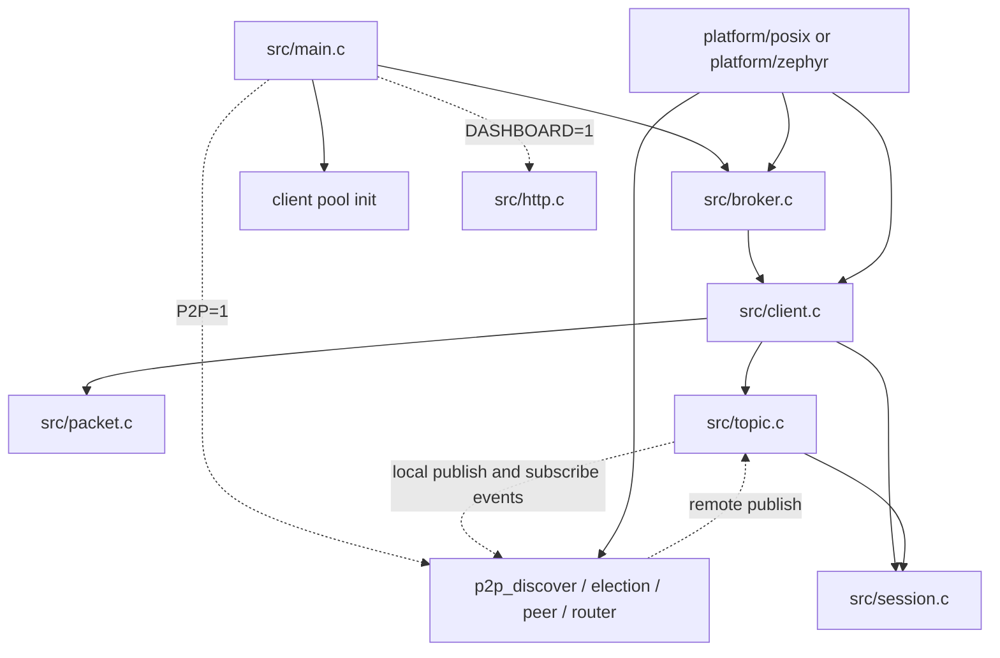
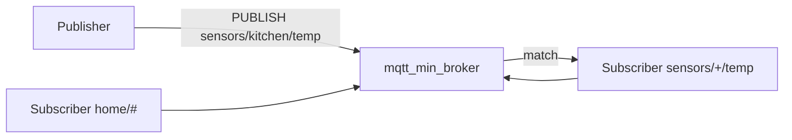
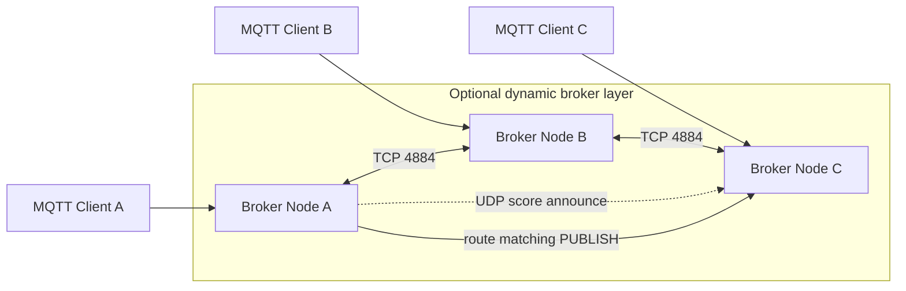
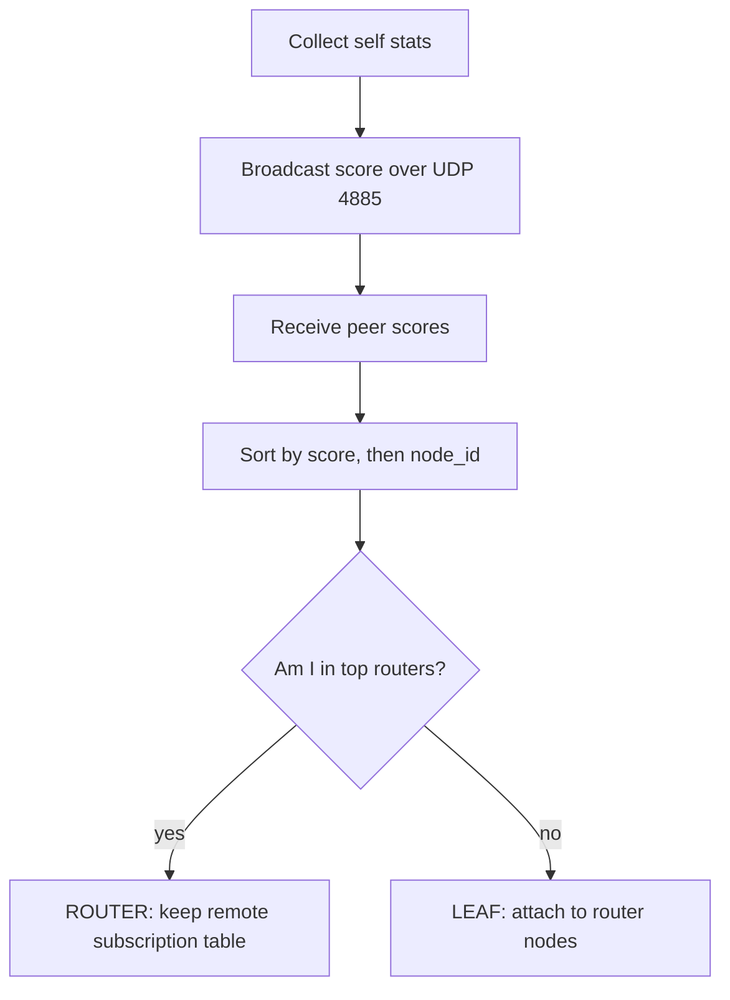

# mqtt_min_broker

A minimal MQTT v3.1.1 broker written in C. It runs on Linux for development
and testing, and on Zephyr RTOS / ESP32 for embedded use. The broker keeps the
core path small, avoids heap allocation in the hot path, and supports optional
dynamic P2P routing between brokers.

## Current Status

Latest module release: `minmqtt-v0.1.15` (2026-06-19).

Recent hardening releases tightened MQTT packet helper behavior without changing
the public module shape:

- `minmqtt-v0.1.15`: dashboard HTTP sends handle partial writes and startup errors
- `minmqtt-v0.1.14`: P2P background thread startup reports pthread failures
- `minmqtt-v0.1.13`: static seed-only P2P mode skips UDP discovery sockets
- `minmqtt-v0.1.12`: SUBSCRIBE and UNSUBSCRIBE parsers reject empty topic lists
- `minmqtt-v0.1.11`: parsers reject reserved PUBLISH QoS and packet_id=0 in
  QoS PUBLISH, SUBSCRIBE, and UNSUBSCRIBE packets
- `minmqtt-v0.1.10`: parser APIs reject NULL arguments for CONNECT, PUBLISH,
  SUBSCRIBE, and UNSUBSCRIBE helpers
- `minmqtt-v0.1.9`: Remaining Length encode/decode helpers reject NULL
  arguments
- `minmqtt-v0.1.8`: CONNACK and SUBACK builders reject invalid return/session
  combinations

Validation for the latest release:

```bash
make -f Makefile.linux unit-tests
make -f Makefile.linux all test-helpers && ./scripts/test_broker.sh
```

Recent ESP32-like workload, `ESP32_BROKER_COUNTS="1 5" ESP32_TOPICS=100`
`ESP32_MESSAGES=1000` with distributed publishers enabled.

| Implementation | Brokers | Throughput | p95 latency | Result |
|----------------|---------|------------|-------------|--------|
| mqtt_min_broker | 1 | 70,550.14 msg/s | 2.794 ms | pass |
| mqtt_min_broker | 5 | 62,341.01 msg/s | 0.421 ms | pass |

This run includes next-hop P2P publish routing, shard-owner caching, reduced
publish contention, and TCP small-packet tuning (`TCP_NODELAY`, and
`TCP_QUICKACK` on Linux when available). The 5-broker case lowers tail latency
sharply, but aggregate throughput on this host is not yet linear with broker
count.

## Contents

- [Core Capabilities](#core-capabilities)
- [Project Direction](#project-direction)
- [Dependency Model](#dependency-model)
- [System Layout](#system-layout)
- [Broker Modes](#broker-modes)
- [Field Bridge Scenario](#field-bridge-scenario)
- [Getting Started](#getting-started)
- [Benchmarks](#benchmarks)
- [Testing](#testing)
- [CLI Reference](#cli-reference)
- [HTTP Dashboard](#http-dashboard)
- [Zephyr / ESP32 Build](#zephyr--esp32-build)
- [Configuration](#configuration)
- [Build Output](#build-output)

## Core Capabilities

- MQTT v3.1.1: QoS 0, QoS 1, QoS 2
- Wildcard subscriptions (`+` and `#`), including `$`-prefix immunity for `#`
- Retained message store
- Persistent sessions with offline message queuing
- QoS-1/2 inflight retry with DUP flag
- Protocol hardening for malformed packets, unsupported versions, and invalid
  packet helper arguments
- Optional username/password auth at build time
- Optional HTTP status dashboard and REST API on Linux
- Optional dynamic broker P2P mode with router election and inter-node routing
- Up to 8 concurrent clients by default, zero heap allocation in broker paths

Not implemented: TLS, WebSocket.

## Project Direction

`mqtt_min_broker` is the reusable broker module repository. It supports two
usage paths:

1. **Zephyr broker module**: another Zephyr application can include this
   repository as a module, enable `CONFIG_MQTT_MIN_BROKER`, bring up its own
   network interface, then call the broker APIs directly. This path should stay
   small and predictable.
2. **Standalone/demo broker build**: this repository can build a simple broker
   app for development and validation. Product-specific field applications
   should live in a separate product repository and consume this module from
   `deps/`.

The Note 1 / Note 2 / Note 3 field bridge app should be a separate product repo
that pins a `mqtt_min_broker` tag in `deps.json`. Core MQTT and P2P behavior
should remain reusable by applications that only want to embed a broker.

The repository split plan is documented here:
[`docs/repository_split_plan.md`](docs/repository_split_plan.md)

## Dependency Model

Product applications should consume `mqtt_min_broker` from their own `deps/`
directory and pin the module version in product-side `deps.json`. The broker
module itself is versioned with Git tags. Product builds should use the pinned
tag unless a broker issue is found, fixed in the module, released as a new tag,
and then explicitly bumped in the product `deps.json`.

The recommended product dependency layout is documented here:
[`docs/product_dependency_model.md`](docs/product_dependency_model.md)

## System Layout



| Area | Files | Purpose |
|------|-------|---------|
| MQTT protocol | `src/client.c`, `src/packet.c` | CONNECT/PUBLISH/SUBSCRIBE handling and packet encode/decode |
| Local routing | `src/topic.c`, `src/session.c` | Local subscriptions, retained messages, persistent sessions |
| Dynamic P2P | `src/p2p_*.c`, `include/p2p.h` | Discovery, election, peer links, remote subscription routing |
| Platform layer | `platform/posix/`, `platform/zephyr/` | Socket, mutex, thread, time, and logging abstraction |

Concurrency is simple: one thread per MQTT client. P2P mode adds discovery,
connect/accept, and peer threads. Shared state is guarded by module-level
mutexes.

## Broker Modes

### Standalone mode

Clients connect to port `1883`, subscribe to topic filters, and receive local
matches.



### Dynamic P2P mode

In dynamic mode, brokers form a small P2P network behind the scenes and route
matching publishes to the node that owns the subscriber.



Enable it with `P2P=1` on Linux or `CONFIG_MQTT_P2P_DYNAMIC=y` on Zephyr.

### Role election

Each node calculates a resource score and announces it. Nodes independently
sort the same table; the top nodes become routers.



Router selection is deterministic and reward-driven. If `P2P_ROUTER_COUNT=0`,
the node evaluates a small set of candidate router counts against live pressure
signals from remote subscriptions, publish rate, and client headroom, then
chooses the highest-reward option.

The current optimization loop is documented here:
[`docs/optimization_loop.md`](docs/optimization_loop.md)

The shard-based ownership model is documented here:
[`docs/p2p_shard_model.md`](docs/p2p_shard_model.md)

## Field Bridge Scenario

The target field scenario is a three-notebook setup where each notebook has a
USB-connected ESP32 running `mqtt_min_broker`. Each notebook opens a local HTML
page to configure WiFi and start its broker. Note 1 is used as the initial
bridge setup point, connects to Note 2 and Note 3, and the brokers then form a
P2P mesh. A 4510 device or data source publishes to the Note 1 broker, while
users subscribed on Note 2 or Note 3 receive that information through broker
routing.

The scenario definition and required product gaps are documented here:
[`docs/field_bridge_scenario.md`](docs/field_bridge_scenario.md)

## Getting Started

Build and test locally with no Zephyr toolchain required:

```bash
make -f Makefile.linux all
./build_out/mqtt_broker
./build_out/mqtt_cli sub -t "test/#"
./build_out/mqtt_cli pub -t test/hello -m "world"
./scripts/test_broker.sh
```

### Build variants

```bash
make -f Makefile.linux DASHBOARD=1
make -f Makefile.linux AUTH_USER=admin AUTH_PASS=secret
make -f Makefile.linux all P2P=1
make -f Makefile.linux all P2P=1 STATIC_SEEDS_ONLY=1
```

### Dynamic broker local test

Linux local multi-node tests seed peers explicitly because same-host UDP
broadcast is not always reliable:

```bash
MQTT_P2P_PEERS=127.0.0.1:48842 ./build_out/mqtt_broker
./scripts/test_p2p_dynamic.sh
./scripts/test_p2p_static_seeds_only.sh
```

Embedders that cannot use UDP discovery can configure peers in code before
`broker_run()`:

```c
p2p_static_seed_clear();
p2p_static_seed_add(peer_addr_s_addr, 4884);
```

Compile-time overrides are available for local tests:

```bash
make -f Makefile.linux all P2P=1 MQTT_PORT=1884 P2P_PORT=4894 P2P_DISCOVERY_PORT=4895
```

## Benchmarks

### Dynamic broker scale benchmark

```bash
TOTAL_SUBS=200 BROKER_COUNTS="1 2 5 50" MESSAGES=50 STARTUP_SEC=1 SYNC_SETTLE_SEC=1 \
    ./scripts/bench_p2p_scale.sh
```

Useful knobs:
- `MOSQUITTO_BENCH=0` skips the mosquitto baseline.
- `DISTRIBUTED_PUBLISHERS=1 SCALE_MESSAGES_BY_BROKER=1` runs one publisher per
  broker and scales total messages with broker count.
- `STATIC_SEED_FANOUT=N` connects each new broker to the previous `N` brokers
  during local static-seed tests.
- `ESP32_PROFILE=1` simulates a tighter ESP32 envelope with smaller client and
  peer caps and a longer settle window.

### ESP32-like workload

Use the dedicated wrapper for the main 1 vs 5 vs 10 style test:

```bash
./scripts/bench_esp32_workload.sh
```

It runs two phases:

1. One broker under heavy client/topic/message load.
2. An ESP32-like broker mesh at 5 and 10 nodes, using distributed publishers so
   each broker carries a share of ingress load.

Tune each phase independently with `SINGLE_BROKER_*` and `ESP32_*`
environment variables.

Recent local result:

| Implementation | Brokers | Total subs | Messages | Throughput | p95 latency |
|----------------|---------|------------|----------|------------|-------------|
| mqtt_min_broker | 1 | 100 | 1000 | 70,550.14 msg/s | 2.794 ms |
| mqtt_min_broker | 5 | 500 | 5000 | 62,341.01 msg/s | 0.421 ms |

The benchmark disables Nagle on its MQTT client sockets. The broker also sets
`TCP_NODELAY` for MQTT and P2P TCP sockets on POSIX builds, with `TCP_QUICKACK`
when available, so small-packet latency is not dominated by delayed ACK timing.
P2P publish routing uses next-hop subscription state, so routers forward only to
peers that lead to matching subscribers instead of broadcasting every publish to
all router peers.

Current benchmark notes:
- The mesh is stable in the 1 vs 5 ESP32-like workload.
- Five brokers reduce tail latency materially.
- Remaining work is throughput scaling, not delivery correctness.

For the evaluation matrix that focuses on `1` vs `5` vs `10` ESP32-like brokers,
plus node-down and restart faults, use:

[`docs/mesh_test_matrix.md`](docs/mesh_test_matrix.md)

## Testing

```bash
./scripts/test_broker.sh
./scripts/test_session.sh
./scripts/test_malformed.sh
./scripts/test_connect_edge.sh
./scripts/test_p2p_dynamic.sh
```

Unit tests run with `make -f Makefile.linux unit-tests`:
- `tests/unit_packet.c`
- `tests/unit_session.c`
- `tests/unit_topic.c`
- `tests/unit_topic_match.c`

## CLI Reference

```text
mqtt_cli pub  [-h HOST] [-p PORT] [-i ID] [-u USER] [-P PASS]
              -t TOPIC -m MSG [-q 0|1] [-r]

mqtt_cli sub  [-h HOST] [-p PORT] [-i ID] [-u USER] [-P PASS]
              -t TOPIC [-q 0|1]

mqtt_cli status [-h HOST] [-p PORT]
```

| Option | Default | Description |
|--------|---------|-------------|
| `-h HOST` | `127.0.0.1` | Broker host |
| `-p PORT` | `1883` (MQTT) / `8080` (status) | Port |
| `-i ID` | `mqtt_cli_<pid>` | Client ID |
| `-u USER` | — | Username |
| `-P PASS` | — | Password |
| `-t TOPIC` | — | Topic |
| `-m MSG` | — | Message payload |
| `-q 0\|1` | `0` | QoS level |
| `-r` | off | Set retained flag |

`sub` prints one line per received message: `topic payload`. `status` hits the
HTTP dashboard's `/api/status` endpoint and prints the JSON response.

## HTTP Dashboard

Enable with `DASHBOARD=1` at build time. Serves on port 8080:

| Endpoint | Description |
|----------|-------------|
| `GET /` | HTML page with connected clients, subscriptions, retained messages, and publish form |
| `GET /api/status` | JSON snapshot of broker state |
| `POST /api/publish` | Publish a message: `{"topic":"…","payload":"…","qos":0}` |

## Zephyr / ESP32 Build

### As a reusable Zephyr module

Add this repository as a Zephyr module, then enable:

```text
CONFIG_MQTT_MIN_BROKER=y
```

The embedding application owns `main()`, WiFi/Ethernet provisioning, and any
product UI. A minimal app flow is:

```c
#include "broker.h"
#include "client.h"
#include "p2p.h"

int main(void)
{
    /* Bring up network interface here. */
    client_pool_init();
    broker_init();

#if defined(CONFIG_MQTT_P2P_DYNAMIC)
    p2p_start();
#endif

    broker_run();
    return 0;
}
```

Enable `CONFIG_MQTT_P2P_DYNAMIC=y` only when the embedding app wants broker mesh
routing.

### As the standalone broker demo

Use this path for broker development or smoke testing. The standalone build
includes the built-in `main()` and WiFi startup. The full Note 1 / Note 2 /
Note 3 field bridge product should live in a separate product repository that
pins this module through `deps.json`.

No Zephyr toolchain or SDK is needed on the host.

```bash
./docker-build.sh
BOARD=esp32s3 ./docker-build.sh
REBUILD_ENV=1 ./docker-build.sh
```

Firmware lands in `./build_out/` (`zephyr.bin`, `zephyr.elf`).

Flash from host after build:

```bash
west flash
west espressif monitor
```

## Configuration

### Kconfig options

| Option | Default | Description |
|--------|---------|-------------|
| `CONFIG_MQTT_MIN_BROKER` | n | Enable the reusable Zephyr broker module |
| `CONFIG_MQTT_STANDALONE` | n | Include built-in `main()` and WiFi startup when used as a module |
| `CONFIG_MQTT_AUTH_ENABLED` | n | Require username + password on CONNECT |
| `CONFIG_MQTT_AUTH_USERNAME` | `"admin"` | Required username |
| `CONFIG_MQTT_AUTH_PASSWORD` | `""` | Required password |
| `CONFIG_MQTT_WIFI_SSID` | `""` | WiFi SSID |
| `CONFIG_MQTT_WIFI_PASSWORD` | `""` | WiFi password |
| `CONFIG_MQTT_WIFI_DHCP` | y | Use DHCP |
| `CONFIG_MQTT_HTTP_DASHBOARD` | n | HTTP dashboard (Linux only) |
| `CONFIG_MQTT_P2P_DYNAMIC` | n | Dynamic router election and inter-node routing |
| `CONFIG_MQTT_P2P_STATIC_SEEDS_ONLY` | n | Use configured static P2P seeds instead of discovery-driven outbound peer selection |

Copy `prj.conf.template` to `prj.conf` and fill in credentials. `prj.conf` is
gitignored.

### Code-level constants

| Constant | Default | Description |
|----------|---------|-------------|
| `MQTT_BROKER_PORT` | `1883` | TCP listen port |
| `MQTT_MAX_CLIENTS` | `8` | Max concurrent connections |
| `CLIENT_STACK_SIZE` | `2048` | Per-client thread stack (bytes, Zephyr) |
| `CLIENT_INFLIGHT_MAX` | `4` | QoS-1 inflight slots per client |
| `MQTT_TOPIC_MAX` | `128` | Max topic length |
| `MQTT_PAYLOAD_MAX` | `512` | Max publish payload |

## Build Output

All build artifacts land in `build_out/`. Each file is stamped with version and
date; an unversioned `latest` symlink is also created.

| Symlink (always latest) | Stamped file | Platform |
|------------------------|--------------|----------|
| `build_out/mqtt_broker` | `build_out/mqtt_broker_v0.1.12_20260619` | Linux |
| `build_out/mqtt_cli` | `build_out/mqtt_cli_v0.1.12_20260619` | Linux |
| `build_out/zephyr.bin` | `build_out/zephyr_v0.1.12_20260619.bin` | Zephyr/ESP32 |
| `build_out/zephyr.elf` | `build_out/zephyr_v0.1.12_20260619.elf` | Zephyr/ESP32 |
| `build_out/zephyr.map` | `build_out/zephyr_v0.1.12_20260619.map` | Zephyr/ESP32 |

Version is read from the Zephyr-format `VERSION` file. Override at build time:

```bash
make -f Makefile.linux VERSION=1.2.3
VERSION=1.2.3 ./docker-build.sh
```

`build_out/` is gitignored.
