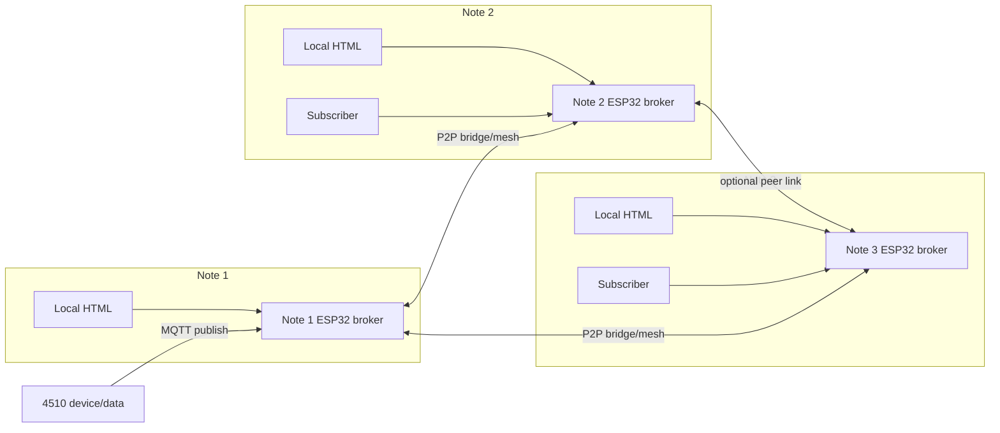

# 現場 Bridge 使用場景

這份文件定義 `mqtt_min_broker` 的其中一個完整應用：多台筆電各自插上一顆
ESP32 mini MQTT broker，透過本機 HTML 介面啟動 WiFi、啟動 broker，並讓
broker 之間自動串連。使用者只需要在任一節點訂閱資料，系統會把其他節點
上的資訊透過 broker mesh 傳過來。

這個場景是產品應用層，不取代 broker module 方向。核心
broker 仍應保持可被其他 Zephyr 專案簡單 include：其他專案可以只啟用
`CONFIG_MQTT_MIN_BROKER`，自己負責 WiFi、UI 與 `main()`，再呼叫 broker API。
產品應用建議另外開 repo，透過 `deps/` 放入固定 tag 的 `mqtt_min_broker`，
並用產品端 `deps.json` 鎖定版本。

## 場景目標

- Note 1、Note 2、Note 3 都可以各自啟動一個 ESP32 broker。
- 每台筆電透過本機 HTML 介面設定該 ESP32 的 WiFi 與 broker 狀態。
- Note 1 作為初始 bridge 設定點，設定要連到 Note 2、Note 3 的 WiFi /
  broker endpoint。
- Note 1、Note 2、Note 3 的 broker 會自動建立 P2P 連線。
- 使用者在 Note 2 或 Note 3 訂閱 broker 時，仍可收到 Note 1 broker 上
  的 4510 資訊。

## 雙模式定位

| 模式 | 目標 | 使用方式 |
|------|------|----------|
| Zephyr broker module | 給其他 Zephyr 專案簡單 include broker 功能。 | 啟用 `CONFIG_MQTT_MIN_BROKER`，app 自己提供網路初始化與 `main()`。 |
| Standalone field app | 在產品 repo 直接 build 出本文件定義的 Note 1/2/3 現場 bridge 應用。 | 產品端從 `deps.json` 指定 `mqtt_min_broker` tag，產品 app 自己提供 WiFi 啟動、broker 啟動、P2P 與本機 HTML provisioning。 |

後續新增 HTML provisioning、bridge peer 設定、4510 現場流程時，應放在
產品 repo 的 standalone field app 層；broker core 與 P2P module 要維持可重用。
版本與 `deps/` 規則見 [`product_dependency_model.md`](product_dependency_model.md)。

## 角色定義

| 角色 | 說明 |
|------|------|
| Note 1 | 現場主要節點，連接 mini MQTT broker ESP32，接收或持有 4510 資訊。 |
| Note 2 | 現場副節點，連接自己的 ESP32 broker，透過 bridge/mesh 取得 Note 1 資訊。 |
| Note 3 | 現場副節點，行為同 Note 2。 |
| ESP32 broker | 執行 `mqtt_min_broker` 的嵌入式 broker 節點。 |
| 4510 | 發布資訊到 Note 1 broker 的設備或資料來源。 |
| Local HTML | 筆電開啟的本機設定頁，用來設定 WiFi、啟動 broker、檢視狀態與 bridge。 |

## 現場流程

1. Note 1 插上 mini MQTT broker ESP32。
2. 使用者在 Note 1 開啟本機 HTML 設定頁。
3. 使用者透過 HTML 設定 WiFi，並啟動 Note 1 broker。
4. 4510 連到 Note 1 broker，或由 Note 1 broker 訂閱/接收 4510 資訊。
5. Note 2、Note 3 各自插上 mini MQTT broker ESP32。
6. 使用者分別在 Note 2、Note 3 開啟本機 HTML 設定頁，設定 WiFi 並啟動
   broker。
7. 使用者回到 Note 1 的本機 HTML，設定 bridge 到 Note 2、Note 3 的 WiFi
   或 broker endpoint。
8. Note 1、Note 2、Note 3 的 broker 自動建立 P2P 連線。
9. 使用者在 Note 2 或 Note 3 訂閱對應 topic。
10. Note 1 broker 將 4510 資訊透過 P2P routing 傳到 Note 2、Note 3 的
    broker，再交給當地訂閱者。

## 拓撲



## Topic 建議

4510 資訊應使用穩定 topic prefix，讓 P2P routing 可以用 prefix 判斷資料
歸屬與轉送路徑。

建議格式：

```text
site/<site_id>/4510/<stream>
```

範例：

```text
site/field-a/4510/status
site/field-a/4510/io
site/field-a/4510/event
```

Note 2、Note 3 的使用者可以訂閱：

```text
site/field-a/4510/#
```

## 產品需求

這個場景需要以下能力：

| 能力 | 狀態 |
|------|------|
| MQTT broker | 已有核心實作。 |
| Zephyr module include | 已有 `CONFIG_MQTT_MIN_BROKER` module 基礎。 |
| Product `deps/` version pin | 需補齊產品端 `deps.json`、sync script、build script。 |
| Dynamic P2P routing | 已有 Linux 測試與核心模型。 |
| ESP32 WiFi 連線 | 已有 Zephyr WiFi 基礎。 |
| 本機 HTML dashboard | 目前 Linux dashboard 已有；ESP32/USB provisioning 需補齊。 |
| 從 HTML 啟動/停止 broker | 需補齊控制 API。 |
| 從 HTML 設定 WiFi | 需補齊 provisioning API 與設定保存。 |
| 從 HTML 設定 bridge peers | 需補齊 peer 設定 API 與持久化。 |
| 自動重連與狀態顯示 | WiFi 重連已有基礎；P2P/bridge 狀態頁需補齊。 |

## 驗收條件

- Note 1、Note 2、Note 3 都能從本機 HTML 顯示 broker 狀態。
- Note 1 可在 HTML 中加入 Note 2、Note 3 的 broker endpoint。
- 三台 broker 建立 P2P 連線後，狀態頁能看到 peer 連線狀態。
- 4510 發布到 Note 1 broker 的訊息，Note 2、Note 3 的訂閱者都能收到。
- 任一副節點重啟後，重新連線完成即可再次收到 4510 訊息。
- Note 2 或 Note 3 暫時離線時，不應阻塞 Note 1 本地 broker。

## 設計原則

- Note 1 只是初始設定入口，不應成為永久單點瓶頸。
- Broker 之間應使用 P2P routing 傳送匹配訂閱的資料，不應廣播所有 publish。
- 本機 HTML 應以現場操作為核心：WiFi、broker 狀態、peer 狀態、topic 測試。
- 4510 topic prefix 要穩定，避免每次部署都重新調整 routing 規則。
